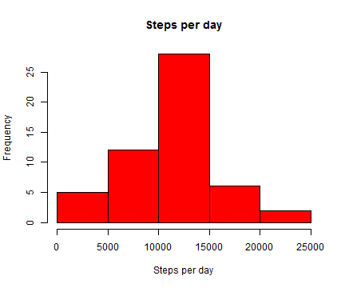
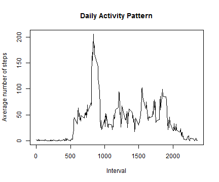
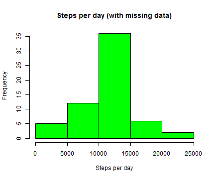
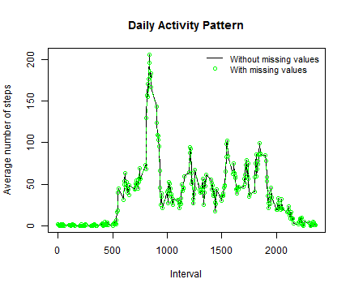
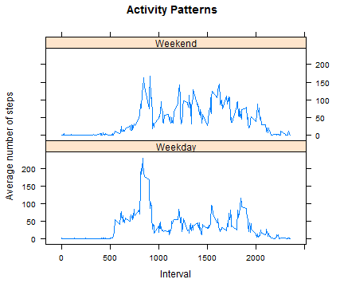

# Reproducible Research: Peer Assessment 1
******

@ Author: Weigardh, A  
@ File: PA1_template.Rmd 
<br>


******
#### Summary
This document describes the procedure to solve the *Peer Assessment 1* assignment in the course *Reproducible Research*.  
The task is to perform various statistics on dataset of personal movement activity.
<br>  
In order to run the code below the Activity monitoring data dataset must be ([downloaded](http://d396qusza40orc.cloudfront.net/repdata%2Fdata%2Factivity.zip)), unzipped and put in the working directory. Unless this is the case, we try to download it below. Furthermore, the lattice library is also used. Unless already installed, it will be done.  
<br>
The dataset consist of data from a personal activity monitoring device. This device collects data at five minute intervals through out the day over a two month period. There is some missing data that we will account for below.
<br>
<br>


******
## Loading and Preprocessing Data
<br>
Start by downloading and unzipping the data if needed.

```r
if (!file.exists("activity.csv")){
    message("Downloading data")
    download.file("http://d396qusza40orc.cloudfront.net/repdata%2Fdata%2Factivity.zip", destfile="activity.zip")
    unzip("activity.zip")
}
```

Read the data from the .csv file

```r
data <- read.csv("activity.csv")
```

Convert the data into date class

```r
data$date <- as.Date(data$date, "%Y-%m-%d")
```
<br>
<br>


******
## Average Total Number of Steps Taken Per Day
<br>
We want to calculate the mean number of steps for each day during the period 2012-10-02 to 2012-11-08.   
First we subset the data, ignoring the incomplete cases where steps is not given. Later we aggregate steps per day into a new data frame, `stepsPerDay`.

```r
completeCases <- data[complete.cases(data),]
stepsPerDay <- aggregate(steps ~ date, data = completeCases, FUN = sum)
```

<br>
Make a histogram over the amount of steps made each day and perform some annotation.

```r
hist(stepsPerDay$steps, xlab = "Steps per day", main = paste("Steps per day"), col = "red")
```

 

The **mean** and **median** for steps taken reads

```r
mean(stepsPerDay$steps)
```

```
## [1] 10766
```

```r
median(stepsPerDay$steps)
```

```
## [1] 10765
```
We see that the values are very equal to each other (10766 and 10765).
<br>
<br>


******
## Average Daily Activity Pattern
<br>
We now want to make time series plot of the 5-minute interval (x-axis) and the average number of steps taken, averaged across all days (y-axis). One can start by creating a variable containing the average for each interval.


```r
stepsPerInterval <- aggregate(steps ~ interval, data = completeCases, FUN = mean)
```

<br>
A plot could be created using the following code

```r
plot(stepsPerInterval, type = "l", xlab = "Interval", ylab="Average number of steps", main = "Daily Activity Pattern")
```

 

The 5-minute interval that contains the highest average should be somewhere around the 800th interval. We can find it out by running

```r
maxStepsPerIntervalValue <- max(stepsPerInterval$steps)
stepsPerInterval[stepsPerInterval$steps==max(stepsPerInterval$steps),]$interval
```

```
## [1] 835
```
At this interval (the **835th** interval ) the value equals 206.1698.
<br>
<br>


******
## Missing Values
<br>
When creating the data frame `completeCases`, we excluded the steps which had the value of NA. We now want to evaluate this missing data more in dept. The total number of steps recorded as NAs is

```r
length(data[(is.na(data$steps)),]$steps)
```

```
## [1] 2304
```
These 2304 missing observations constitute about 13% of the entire dataset (i.e. 8 days of data is missing).

<br>
**Assigning new values**  
We now want to assign values for all NAs. The strategy is very simple. We replace all NA intervals with the average value of the observed intervals we found earlier (that can be found in the data frame `stepsPerInterval`). We round the number so that we we get a discrete amount of steps, which is consistent with what reality dictates.


```r
count <- head(table(data$steps))[1]
head(table(data$steps))
```

```
## 
##     0     1     2     3     4     5 
## 11014     7     8     3    25    17
```

<br>
By running the code above we see that the observation zero is made 11014 times. This is about 72% of the observations from `completeCases` and 63% from the entire dataset, including NAs. We thus expect to replace the missing with many zeros but also some other values that we have experienced before (and a few new ones). This will happen due to that we use the round function. We assign the new values below to the data frame `newDataSet`. For a non-discrete case (where one can observe e.g. 1.414 steps), remove the round function from the code.


```r
newDataSet <- data
for (i in 1:length(newDataSet$steps)){
    if (is.na(newDataSet[i,1])){
    newDataSet[i,"steps"] <- round((stepsPerInterval[stepsPerInterval$interval == newDataSet[i,"interval"],]["steps"]))
    }
}
```

Running similar code as before to see how many zeros there are. 

```r
head(table(newDataSet$steps))
```

```
## 
##     0     1     2     3     4     5 
## 11350   159    96    91    41    41
```
In the new dataset, it has been added a lot of zeros, ones, twos etc. In reality we would probably have experienced a larger share of zeros (and a smaller share of ones, twos, ...) if the missing data could be retrieved.

<br>
**Making new histogram**  
We now repeat the earlier steps to make a new histogram including the missing data. Calculate the mean and median for the total number of steps taken each day and plot the result.

```r
newDataSet$date <- as.Date(newDataSet$date, "%Y-%m-%d")
stepsPerDayNewData <- aggregate(steps ~ date, data = newDataSet, FUN = sum)
```

<br>
Plot the histogram in another color this time.

```r
hist(stepsPerDayNewData$steps, xlab = "Steps per day", main = paste("Steps per day (with missing data)"), col = "green")
```

 

The **mean** and **median** are

```r
mean(stepsPerDayNewData$steps)
```

```
## [1] 10766
```

```r
median(stepsPerDayNewData$steps)
```

```
## [1] 10762
```

<br>
**Comparison of results**  
By taking this approach we get a very similar distribution compared to what we had before. The mean is the same (10766) while the median (10762) went down a bit (-3) . This should not come as a surprise since we add rounded averages to the dataset. By adding non-discrete values we would get even more closer to the old median. The impact on our statistics is thus very small after filling in missing values. We can also, by examining the figure below, see that the daily activity pattern is similar under our method.

```r
stepsPerIntervalNewData <- aggregate(steps ~ interval, data = newDataSet, FUN = mean)
plot(stepsPerInterval, type = "l", xlab = "Interval", ylab="Average number of steps", main = "Daily Activity Pattern")
lines(stepsPerIntervalNewData, col = "green", type = "b", lty = 2)
legend("topright", legend = c("Without missing values","With missing values"), col = c("black","green"), lwd = 1, lty = c(1,NA), pch = c(NA,1), bty='n', cex = 0.9)                                                                                                            
```

 
<br>
<br>


******
## Differences in Activity Patterns
<br>

Below we will evaluate if there is a difference between weekday and weekends. We start by setting the locale R process.  
We later introduce a new column in our latest dataset `newDataSet` that contains information whether the day is a weekday or a weekend. We later create `weekdayData` with the averages for each day.


```r
Sys.setlocale("LC_TIME", "English") 
```

```
## [1] "English_United States.1252"
```

```r
day <- (weekdays(newDataSet$date))
newDataSet$day <- ifelse(day %in% c("Saturday", "Sunday"), "Weekend", "Weekday")
weekdayData <- aggregate(steps ~ (day + interval), newDataSet, mean)
```

<br>
**Creating a panel plot**  
We now make a panel plot of weekdays and weekends to spot any differences. We use the lattice library and a `xyplot()` for this task.

```r
if (!require(lattice)){ 
        install.packages("lattice") 
} 
```

```
## Loading required package: lattice
```

```r
library(lattice)
xyplot(steps ~ interval | day, data = weekdayData, type = "l", main = "Activity Patterns", xlab = "Interval", ylab = "Average number of steps", layout = c(1, 2))
```

 

<br>
We can see that weekdays has a single peak while weekends are more constant over the entire day. This could imply that we're more active earlier during the days in weekdays compared to weekends. This makes sense considering peoples work habits. 

******
**Version used**  
The following version of R was used when creating this document.

> version
               _                           
platform       x86_64-w64-mingw32          
arch           x86_64                      
os             mingw32                     
system         x86_64, mingw32             
status                                     
major          3                           
minor          1.1                         
year           2014                        
month          07                          
day            10                          
svn rev        66115                       
language       R                           
version.string R version 3.1.1 (2014-07-10)  
nickname       Sock it to Me
